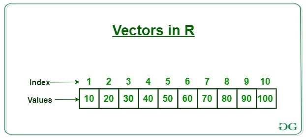

# Introducing R and RStudio IDE

## **Advantages of using R**

------------------------------------------------------------------------

At more than 20 years old, R is fairly mature and [growing in
popularity](https://www.tiobe.com/tiobe-index/r/). However, programming
isn't a popularity contest. Here are key advantages of analyzing data in
R:

-   **R is [open
    source](https://en.wikipedia.org/wiki/Open-source_software)**. This
    means R is free

-   **R is widely used**.

    -   Because, R is used in many areas (not just bioinformatics), you
        are more likely to find help online when you need it.

-   **R is powerful**.

    -   R runs on multiple platforms (Windows/MacOS/Linux).

    -   It can work with much larger datasets than popular spreadsheet
        programs like Microsoft Excel,

    -   because of its scripting capabilities is far more reproducible.

    -   Also, there are thousands of available software packages for
        science, including genomics and other areas of life science.

## **Create an RStudio project**

------------------------------------------------------------------------

One of the first benefits we will take advantage of in RStudio is
something called an **RStudio Project**. An RStudio project allows you
to more easily:

-   Save data, files, variables, packages, etc. related to a specific
    analysis project

-   Restart work where you left off

-   Collaborate, especially if you are using version control such as
    [git](https://swcarpentry.github.io/git-novice/).

1.  To create a project, go to the`File` menu, and click
    `New Project dc_genomics_r`

## **Creating your first R script**

Now that we are ready to start exploring R, we will want to keep a
record of the commands we are using. To do this we can create an R
script:

`File`-\>`New File`-\>`Rscript`

`genomics_r_basics`

## **Overview and customization of the RStudio layout**


## Getting to work with R: navigating directories

Find out where you are using `getwd()`

### Comment code

You should write a notes in our script to explain the purpose of the
command.

Entering a `#` before any line in an R script turns that line into a
comment, which R will not try to interpret as code.

Edit your script to include a comment on the purpose of commands you are
learning

`# this command shows the current working directory`

## Exercise

What happens when you try to enter the `getwd()` command in the Console
pane?

[Organize your data and
code](https://kbroman.org/steps2rr/pages/organize.html)

Use function `dir.create()` to create the directories

-   R
-   data
-   rawdata

```{r create_dir}
# Use function dir.create() to create the directories
```

## Download raw data file

Use function `download.file()` to download the file

<https://ndownloader.figshare.com/files/14632895> to
rawdata/combined_tidy_vcf.csv

```{r download_data}
# Use function download.file() to download the file https://ndownloader.figshare.com/files/14632895 to rawdata/combined_tidy_vcf.csv


```

## Using functions in R, without needing to master them

A function in R (or any computing language) is a short program that
takes some input and returns some output.

Functions may seem like an advanced topic (and they are), but you have
already used at least one function in R.

`getwd()` is a function! The next sections will help you understand what
is happening in any R script.

------------------------------------------------------------------------

## EXERCISE: WHAT DO THESE FUNCTIONS DO?

Try the following functions by writing them in your script.

See if you can guess what they do, and make sure to add comments to your
script about your assumed purpose.

-   `dir()`

-   `sessionInfo()`

-   `date()`

-   `Sys.time()`

------------------------------------------------------------------------

You have hopefully noticed a pattern - an R function has three key
properties:

1.  Functions have a name (e.g. dir, `getwd`); note that functions are
    case sensitive!

2.  Following the name, functions have a pair of `()`

3.  Inside the parentheses, a function may take 0 or more argument

An argument may be a specific input for your function and/or may modify
the function's behavior. For example the function round() will round a
number with a decimal:

## **Getting help with function arguments**

There are a few ways to get help with an R function

-   `?args()`

-   use `args()` function around a function`args(round)`

`round()` takes two arguments,

1.  `x`, which is the number to be rounded, and

2.  a `digits` argument.

The `=` sign indicates that a default (in this case 0) is already set.

Since `x` is not set, `round()` requires we provide it,

in contrast to `digits` where R will use the default value 0 unless you
explicitly provide a different value.

We can explicitly set the digits parameter when we call the function:

`round(3.14159, digits = 2)`

Use two question marks (i.e. `??geom_point()`) and R will return results
from a search of the documentation for packages you have installed on
your computer in the "Help" tab. Finally, if you think there should be a
function, for example a statistical test, but you aren't sure what it is
called in R, or what functions may be available, use the `help.search()`
function.

Finally, what if you are using `?` to get help for a function in a
package not installed on your system, such as when you are running a
script which has dependencies.

`?geom_point()`

------------------------------------------------------------------------

## EXERCISE: SEARCHING FOR R FUNCTIONS

Use`help.search()` to find R functions for the following statistical
functions.

Remember to put your search query in quotes inside the function's
parentheses `()`.

-   Chi-Squared test

-   Student t-test

-   mixed linear model

------------------------------------------------------------------------

## RStudio contextual help

RStudio also provides contextual help. Start typing function `round()`
and use tab

------------------------------------------------------------------------

## Key Points

-   R is a powerful, popular open-source scripting language

-   You can customize the layout of RStudio, and use the project feature
    to manage the files and packages used in your analysis

-   RStudio allows you to run R in an easy-to-use interface and makes it
    easy to find help

------------------------------------------------------------------------

10 minute break

# R Basics (80mins)

## Objectives

-   Be able to create the most common R objects including vectors

-   Understand that vectors have modes, which correspond to the type of
    data they contain

-   Be able to use arithmetic operators on R objects

-   Be able to retrieve (subset), name, or replace, values from a vector

-   Be able to use logical operators in a sub-setting operation

-   Understand that lists can hold data of more than one mode and can be
    indexed

## **What these lessons will not teach you**

**Here are some R skills we will *not* cover in these lessons**

-   How to create and work with R matrices and R lists

-   How to create and work with loops and conditional statements, and
    the "apply" family of functions (which are super useful, read more
    [here](https://www.r-bloggers.com/r-tutorial-on-the-apply-family-of-functions/))

-   How to do basic string manipulations (e.g. finding patterns in text
    using grep, replacing text)

-   How to plot using the default R graphic tools (we *will* cover plot
    creation, but will do so using the popular plotting package
    `ggplot2`)

-   How to use advanced R statistical functions

## Creating objects in R

What might be called a `variable` in many languages, such as python, is
called an **object** in R.

**To create an object you need:**

-   a name (e.g. `a`)

-   a value (e.g. `1`)

-   the assignment operator (`<-`) you can also use an `=`

```{r}
# this line creates the object 'a' and assigns it the value '1'
a <- 1
```

Next, run this line of code in your script. You can run a line of code
by hitting the `Run` button that is just above the first line of your
script in the header of the Source pane or you can use the appropriate
shortcut:

-   Windows execution shortcut: `Ctrl+Enter`

-   Mac execution shortcut: `Cmd(⌘)+Enter`

To run multiple lines of code, you can highlight all the line you wish
to run and then hit Run or use the shortcut key combo listed above.

In the RStudio 'Console' you should see:

The 'Console' will display lines of code run from a script and any
outputs or status/warning/error messages (usually in red).

In the 'Environment' window you will also get a table:

------------------------------------------------------------------------

### EXERCISE: CREATE SOME OBJECTS IN R

Create the following objects; give each object an appropriate name (your
best guess at what name to use is fine):

1.  Create an object that has the value of number of pairs of human
    chromosomes

2.  Create an object that has a value of your favorite gene name

3.  Create an object that has this URL as its value:
    "<ftp://ftp.ensemblgenomes.org/pub/bacteria/release-39/fasta/bacteria_5_collection/escherichia_coli_b_str_rel606/>"

4.  Create an object that has the value of the number of chromosomes in
    a diploid human cell

------------------------------------------------------------------------

## **Naming objects in R**

Here are some important details about naming objects in R.

-   **Avoid spaces and special characters**: Object names cannot contain
    spaces or the minus sign (`-`). You can use '\_' to make names more
    readable. You should avoid using special characters in your object
    name (e.g. ! \@ \# . , etc.). Also, object names cannot begin with a
    number.

-   **Use short, easy-to-understand names**: You should avoid naming
    your objects using single letters (e.g. 'n', 'p', etc.). This is
    mostly to encourage you to use names that would make sense to anyone
    reading your code (a colleague, or even yourself a year from now).
    Also, avoiding excessively long names will make your code more
    readable.

-   **Avoid commonly used names**: There are several names that may
    already have a definition in the R language (e.g. 'mean', 'min',
    'max'). One clue that a name already has meaning is that if you
    start typing a name in RStudio and it gets a colored highlight or
    RStudio gives you a suggested autocompletion you have chosen a name
    that has a reserved meaning.

-   **Use the recommended assignment operator**: In R, we use '\<- '

```{r}
# example of bad names
#1val=1
#val?q=1
#first val=1
```

## **Reassigning object names or deleting objects**

Once an object has a value, you can change that value by overwriting it.

[**R will not give you a warning or error**]{.ul} if you overwriting an
object, which may or may not be a good thing depending on how you look
at it.

print contents of object gene \_name

`gene_name` has the value 'pten' or whatever value you used in the
challenge.

We will now assign the new value 'TP53'

### Removing R objects

You can also remove an object from R's memory entirely.

The `rm()` function will delete the object.

delete the object '`gene_name`' using `rm()`

If you run a line of code that has only an object name, R will normally
display the contents of that object.

In this case, we are told the object no longer exists.

## Understanding object data types (modes)

In R, every object has two properties:

-   `Length`: How many distinct values are held in that object

-   `Mode`: What is the classification (type) of that object.

We will get to the "length" property later in the lesson.

**The "`mode`" property corresponds to the type of data an object
represents.**

The most common modes you will encounter in R are:

-   `numeric`: Numbers such floating point,decimals (`1.0,` `0.5`,
    `3.14`)
-   `character` A sequence of letters or numbers in single '' or double
    "" quotes

<!-- -->

-   `Logical Boolean` values - `TRUE` or `FALSE`

There are a few other modes (i.e. "`complex`", "`raw`" etc.) but these
are the three we will work with in this lesson.

------------------------------------------------------------------------

## **Exercise: Create objects and check their modes**

Create the following objects in R,

then use the `mode()`function to verify their modes.

Try to guess what the mode will be before you look at the solution

```{r}
chromosome_name <- 'chr02'
od_600_value <- 0.47
chr_position <- '1001701'
spock <- TRUE
pilot <- Earhart
```

------------------------------------------------------------------------

## Mathematical and functional operations on objects

R has a number of mathematical operators that you can use

-   addition `+`
-   subtraction `-`
-   multiplication `*`
-   division `/`
-   `^` or `**` exponentiation
-   a`%%`b modulus (returns the remainder after division)

These can be used with literal numbers:

    2^2
    4/1.5
    (2^2)/1.5
    (1 + (5 ** 0.5))/2

And importantly, can be used on any `object` that evaluates to (i.e.
interpreted by R) a numeric object:

-   assign numeric value of 23 to object `human_chr_number`

-   multiply, \* ,the object 'human_chr_number' by 2

<!-- -->

------------------------------------------------------------------------

### EXERCISE: COMPUTE THE GOLDEN RATIO

One approximation of the golden ratio (φ) can be found by taking

1.  the sum of 1 and the square root of 5,

2.  and dividing by 2

Compute the golden ratio to [**3 digits**]{.ul} of precision using the

`sqrt()` and

`round()` functions.

**Hint:** remember the `round()` function can take 2 arguments.

------------------------------------------------------------------------

## Vectors

**`Vectors`** are probably the most used commonly used object type in R.

A vector is a [collection]{.ul} of values that are [**all of the same
typ**]{.ul}**e** (numbers, characters, etc.).

{width="456"}

One of the most common ways to create a vector is to use the

`c()` function - the "concatenate" or "combine" function.

Inside the function you may enter one or more values; for multiple
values, separate each value with a comma:

For example

`c(10, 20, 30, 40, 50, 60, 70, 80, 90, 100)`

Let create the vector `snp_genes` using these gene names

using the `c()` function.

```{r}
# Create the snp_genes  vector "OXTR", "ACTN3", "AR", "OPRM1"
```

Vectors always have a **mode** and a **length**. You can check these
with the

`mode()` and

`length()` functions respectively.

Let's find the mode and length of the vector object `snp_genes`

```{r}
# Check the 1, mode, 2, length of snp_genes

```

Another useful function that gives both of these pieces of information
is the `str()` (structure) function.

```{r}
# check str of snp_genes
```

## Creating and subsetting vectors

Let's create a few more vectors to play around with:

```{r }
# Some interesting human SNPs
# while accuracy is important, typos in the data won't hurt you here

# snps vector that contains rs53576, rs1815739, rs6152, rs1799971
# snp_chromosomes vector contains 3, 11, X, 6
# snp_positions vector contains 8762685, 66560624, 67545785, 154039662
```

## Retrieve values from a vector

Once we have vectors, one thing we may want to do is specifically
retrieve one or more values from our vector.

To do so, we use bracket notation.

We type the name of the vector followed by square brackets. `[]`

In those square brackets we place the index (e.g. a number) in that
bracket as follows:

In R index start from\*\* 1


```{r}
#Get the 3rd value in the `snp_genes` vector
```

### Using Ranges

In R, every item your vector is indexed, starting from the first item
through to the final number of items in your vector.

You can also retrieve a range of numbers: `<start_num>:<end_num>`

For example, the numbers 1 to 10 can be defined as such;

`1:10`

```{r}
#Let's get the 1st through 3rd value in the `snp_genes` vector
```

If you want to retrieve several (but not necessarily sequential) items
from a vector,

you pass a **vector of indices**; a vector that has the numbered
positions you wish to retrieve.

```{r}
#Let's get the 1st, 3rd, and 4th value in the snp_genes vector
```

There are additional (and perhaps less commonly used) ways of subsetting
a vector (see [these
examples](https://thomasleeper.com/Rcourse/Tutorials/vectorindexing.html)).

Also, several of these subsetting expressions can be combined:

```{r}
#Let's get the 1st through the 3rd value using range operator, and 4th
#value in the snp_genes vector
```

## Adding to, removing, or replacing values in existing vectors

Once you have an existing vector, you may want to add a new item to it.

To do so, you can use the `c()` function again to add your new value:

```{r}
#Add the gene 'CYP1A1'and 'APOA5' to our list of snp genes.
```

We can verify that `snp_genes` contains the new gene entry by evaluating
the object

#### Negative indexes

Using a negative index `-` will return a version a vector with that
index's value removed:

```{r}
#Remove the sixth entry from `snp_genes` vector.
```

Using a negative index will return a version of a vector with that
index's value removed:

We can remove that value from our vector by overwriting it with this
expression:

Let's remove 6th element of vector `snp_genes`and store in `snp_genes`

Let's display contents of `snp_genes` and use `length()`

```{r}
#remove 6th element of vector `snp_genes`and store in `snp_genes`

#Let's display contents of `snp_genes` and use `length()`

```

#### Assigning by index

We can also explicitly rename or add a value to our index using double
bracket notation `[]` and assigment operator `<-`

Let's add the gene name "APOA5" as the 6th item of the vector using
`[ ]`notation

```{r}
#add the name "APOA5" as the 6th item of the vector using [ ]notation
```

------------------------------------------------------------------------

## **Exercise: Examining and subsetting vectors**

Answer the following questions to test your knowledge of vectors

Which of the following are true of vectors in R?

A)  All vectors have a `mode` **or** a `length`\
B)  All vectors have a `mode` **and** a `length`\
C)  Vectors may have different lengths\
D)  Items within a vector may be of different modes\
E)  You can use the `c()` to add one or more items to an existing
    vector\
F)  You can use the `c()` to add a vector to an exiting vector

------------------------------------------------------------------------

## Logical Subsetting

`TRUE` `FALSE`

There is one last set of subsetting capabilities we want to introduce.

It is possible within R to retrieve items in a vector based on a logical
evaluation or numerical comparison.

E.g.

let's say we wanted get all of the SNPs in our vector of SNP positions
that were greater than 100,000,000.

We could index using the `>` (greater than) logical operator:

`snp_positions[snp_positions > 100000000]`

Some of the most common logical operators you will use in R are:

    Operator    Description
    <           less than
    <=          less than or equal to
    >           greater than
    >=          greater than or equal to
    ==           exactly equal to
    !=           not equal to
    !x           not x
    a | b        a or b
    a & b        a and b

Create a Logical vector of `snp_positions`\> 100000000 but don't assign
it to an object

```{r}
# Create a Logical vector of snp_positions> 100000000

#check it's length
```

Use function `which()` to get index(position) of `snp_pop_gt1M` vector

```{r}
# which snp_positions > 1e6
```

## **A few final vector tricks**

### Not Available' / Missing Values

Finally, there are a few other common retrieve or replace operations you
may want to know about.

First, you can check to see if any of the values of your vector are
missing (i.e. are `NA`).

The `is.na()` function will return a logical vector with TRUE for any NA
value:

Q. Find NA values value of `snp_genes` vector

```{r}
# print current value of snp_genes 

# use is.na to get logical vector using which item is na in snp_genes

```

### IN

Sometimes, you may wish to find out if a specific value (or several
values) is present a vector.

You can do this using the comparison operator `%in%`

`%in%`which will return `TRUE` for any value in your collection that is
in the vector you are searching

```{r}
# print current value of snp_genes

# test to see if "ACTN3" or "APO5A" is in the snp_genes vector
# if you are looking for more than one value, you must pass this as a vector

```

------------------------------------------------------------------------

## **Review Exercise 1**

What data types/modes are the following vectors?

a.  `snps`
b.  `snp_chromosomes`
c.  `snp_positions`

------------------------------------------------------------------------

## **Review Exercise 2**

Add the following values to the specified vectors:

a.  To the `snps` vector add: 'rs662799'
b.  To the `snp_chromosomes` vector add: 11
c.  To the `snp_positions` vector add: 116792991

------------------------------------------------------------------------

## **Review Exercise 3**

Make the following change to the `snp_genes` vector:

Hint: Your vector should look like this in 'Environment':
`chr [1:7] "OXTR" "ACTN3" "AR" "OPRM1" "CYP1A1" NA "APOA5"`. If not
recreate the vector by running this expression:
`snp_genes <- c("OXTR", "ACTN3", "AR", "OPRM1", "CYP1A1", NA, "APOA5")`

a.  Create a new version of `snp_genes` that does not contain `CYP1A1`
    and then

b.  Add 2 NA values to the end of `snp_genes`

## **Extra List: Review Exercise 4**

Using indexing, create a new vector named `combined` that contains:

-   The the 1st value in `snp_genes`

-   The 1st value in `snps`

-   The 1st value in `snp_chromosomes`

-   The 1st value in `snp_positions`

Using indexing, create a new vector named `combined` that contains:

-   The the 1st value in `snp_genes`

-   The 1st value in `snps`

-   The 1st value in `snp_chromosomes`

-   The 1st value in `snp_positions`

## **Review Exercise 5**

What type of data is `combined`?

# Extra Material

## Lists

Lists are quite useful in R, but we won't be using them in the genomics
lessons.

One of the key attributes of a list is that, unlike a vector, a list may
contain data of more than one mode.

In this one example, we will create a named list and show you how to
retrieve items from the list.

Create a named list using the `list()` function and our SNP examples

To run this command, make sure the entire command (all 4 lines) are
highlighted before running.

Note also, as we are doing all this inside the list() function use of
the '=' sign is good style

```{r create_list}
snp_genes<-c("OXTR", "ACTN3", "AR", "OPRM1")
snps <- c('rs53576', 'rs1815739', 'rs6152', 'rs1799971')
snp_chromosomes <- c('3', '11', 'X', '6')
snp_positions <- c(8762685, 66560624, 67545785, 154039662)

snp_data <- list(genes = snp_genes,
                 reference_snp = snps,
                 chromosome = snp_chromosomes,
                 position = snp_positions)
```

## List positions by name `$`

To get all the values for the position object in the list, we use the
`$` notation:

Q. Return all the values of `position` object

To get the first value in the position object, use the `[]` notation to
index:

```{r}
# get all position values in snp_data


# get first position value
```

------------------------------------------------------------------------

## Key Points

-   Effectively using R is a journey of months or years. Still you don't
    have to be an expert to use R and you can start using and analyzing
    your data with with about a day's worth of training

-   It is important to understand how data are organized by R in a given
    object type and how the mode of that type (e.g. `numeric`,
    `character`, logical, etc.) will determine how R will operate on
    that data.

-   Working with `vectors` effectively prepares you for understanding
    how data are organized in R.

# Introduction to the example dataset and file type

<https://datacarpentry.org/genomics-r-intro/02-data-prelude.html>

slides
