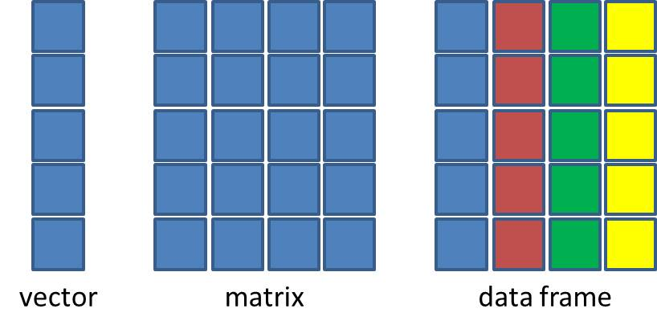
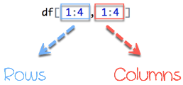

# R Basics continued - factors and data frames

-   How do I get started with tabular data (e.g. spreadsheets) in R?

-   What are some best practices for reading data into R?

-   How do I save tabular data generated in R?

## **Working with spreadsheets (tabular data)**

## **Working with spreadsheets (tabular data)**

------------------------------------------------------------------------

A substantial amount of the data we work with in genomics will be
tabular data, this is data arranged in rows and columns - also known as
spreadsheets.

We could write a whole lesson on how to work with spreadsheets
effectively ([actually we
did](https://datacarpentry.org/organization-genomics/)).

For our purposes, we want to remind you of a few principles before we
work with our first set of example data:

**1) Keep raw data separate from analyzed data**

This is principle number one because if you can't tell which files are
the original raw data, you risk making some serious mistakes
(e.g. drawing conclusion from data which have been manipulated in some
unknown way).

**2) Keep spreadsheet data Tidy**

The simplest principle of **Tidy data** is that we have

1.  **One row** in our spreadsheet for each observation or sample,
2.  and **One column** for every variable that we measure or report on.

As simple as this sounds, it's very easily violated.

Most data scientists agree that significant amounts of their time is
spent tidying data for analysis.

**3) Trust but verify**

Finally, while you don't need to be paranoid about data, you should have
a plan for how you will prepare it for analysis.

**This a focus of this lesson.** You probably already have a lot of
intuition, expectations, assumptions about your data - the range of
values you expect, how many values should have been recorded, etc.

Of course, as the data get larger our human ability to keep track will
start to fail (and yes, it can fail for small data sets too).

R will help you to examine your data so that you can have greater
confidence in your analysis, and its reproducibility.

## **Importing tabular data into R**

------------------------------------------------------------------------

### EXERCISE: REVIEW THE ARGUMENTS OF THE `read.csv()` FUNCTION

**Before using the `read.csv()` function, use R's help feature to answer
the following questions**.

***Hint*****:** Entering '?' before the function name and then running
that line will bring up the help documentation. Also, when reading this
particular help be careful to pay attention to the 'read.csv' expression
under the 'Usage' heading. Other answers will be in the 'Arguments'
heading.

1.  What is the default parameter for 'header' in the `read.csv()`
    function?

2.  What argument would you have to change to read a file that was
    delimited by semicolons (;) rather than commas?

3.  What argument would you have to change to read file in which numbers
    used commas for decimal separation (i.e. 1,00)?

4.  What argument would you have to change to read in only the first
    10,000 rows of a very large file?

------------------------------------------------------------------------

There are several ways to import data into R.

For our purpose here, we will focus on using the tools every R
installation comes with (so called "`base`" R)

to import a comma-delimited file containing the results of our variant
calling workflow.

We will need to load the sheet using a function called `read.csv()`.

Now let's read in the file `combined_tidy_vcf.csv` and assign to new
object `variants`

```{r}
# a list bit on filepaths getwd(), dir()

# read in file combined_tidy_vcf.csv using read.csv() assign as obj variant
```

### Environment window

One of the first things you should notice is that in the Environment
window, you have the `variants` object, listed

as 801 obs. (observations/rows) of 29 variables (columns).

Double-clicking on the name of the object will open a view of the data
in a new tab.

You can also use `View()`function to bring up inbuilt data frame viewer

```{r}
# Use View() on variants
```

## Summarizing and determining the structure of a data frame.

-   A data frame is the standard way in R to store tabular data.

-   A data fame could also be thought of as a collection of vectors, all
    of which have the same length.

{width="369"}

-   Using only two functions, we can learn a lot about out data frame
    including some summary statistics as well as well as the "structure"
    of the data frame.

The first function we will use to explore our data.frame is `summary`

```{r}
# show help summary
# use the summary() function on our data.frame variants
```

Our data frame had 29 variables (columns), so we get 29 fields that
summarize the data.

The `QUAL`, `IMF`, and `VDB` variables (and several others) are
numerical data.

For numeric variables, **`summary()`** will provide a five-number
statistical summary:

1.  min

2.  max

3.  mean,

4.  median

5.  interquartile ranges (IQR).

Many of the other variables (e.g. `sample_id`) are treated as characters
data .

For `logical` variables or categorical variables (for example, columns
that contain text or discrete values),

**`summary()`** will provide a frequency count of the levels/categories
present.

For example the INDEL columns contains 101 `TRUE` and 700 `FALSE`
values.

Many of the other variables (e.g. `sample_id`) are treated as characters
data (more on this in a bit).

### Structure

Now, let's use the `str()` (structure) function to look a little more
closely at how data frames work:

```{r str}
# Use the str() function on the variants data frame.

```

Ok, thats a lot up unpack! Some things to notice.

-   the object type `data.frame` is displayed in the first row along
    with its dimensions, in this case 801 observations (rows) and 4
    variables (columns)

-   Each variable (column) has a name (e.g. `sample_id`).

    -   This is followed by the object mode (e.g. chr, int, etc.).

    -   Notice that before each variable name there is a `$`

We can use the `$` symbol to extract a single column of a data frame

`<object_name>$<column_name>`

To get the CHROM column

`variants$CHROM`

```{r}
# extract a REF column from the variants object using $ syntax
```

### Skimr

A really useful function is `skim()` from the
[skimr](https://cran.r-project.org/web/packages/skimr/index.html)
package.

Packages are extra code libraries that extend the functionality of R.

We will need to install this package using the function
`install.packages()` or the Packages helper in rstudio

```{r}
# install skimr package

#load skimr library

#use skim() function of variants dataframe
```

## Introducing Factors

`Factors` are the final major data structure we will introduce in our R
genomics lessons.

-   `Factors` can be thought of as `vectors` which are specialized for
    **categorical data**.

-   Categorical data is data that can take on a limited number of
    distinct categories or level?

------------------------------------------------------------------------

### Exercise: Factors

look at the `variants` data.frame and write down on the collaborative
document which variable could be defined as factors.

------------------------------------------------------------------------

### Why Factors?

Factors are very important in statistical modeling and are a fundamental
part of R's data handling.

Here are a few reasons why factors are useful in R:

1.  **Statistical Modeling**: In statistical models, categorical
    variables need to be coded in such a way that the model can
    understand the categories as distinct groups. Factors provide this
    functionality by internally representing categories with integers.

2.  **Data Integrity**: Factors help maintain data integrity by ensuring
    that the data can only take on a limited number of levels.

    1.   This is helpful when you know that a variable should only have
        certain values.

3.  **Efficient Storage**: Factors can be a more efficient way to store
    categorical data because each unique value is stored only once and
    the data itself is stored as integer references to the unique
    values.

    ```{r}

    ```

4.  **Ordered Levels**: Factors can have ordered levels, which is useful
    for ordinal variables (where the order matters, such as "low",
    "medium", "high").

5.  **Data Analysis**: Many R functions are designed to work with
    factors and can provide informative output when given factor input.

6.  For example,

    1.  the **`table()`** function will produce a frequency count of the
        factor levels,

    2.  and the **`summary()`** function will do the same.

Let's see the value of treating some of other variables which are
categorical in nature as factors.

Let's take a look at just the alternate alleles `ALT`

To simplify, lets look at just the single-nucleotide alleles (SNPs).

```{r}
# for this demo we will use only snps
snp_df<-variants[variants$INDEL==FALSE,]

#extract the "ALT" column to a new vector object alt_alleles

#Let’s look at the first few items in our factor using head():
```

There are 700 alleles (one for each row).

We can use some of the vector indexing skills from the last episode.

```{r}
# create a vector snp by subsetting alt_alleles in A,T,G,C
snps <- c(alt_alleles[alt_alleles=="A"],
  alt_alleles[alt_alleles=="T"],
  alt_alleles[alt_alleles=="G"],
  alt_alleles[alt_alleles=="C"])
```

This leaves us with a vector of the 700 alternative alleles which were
single nucleotides.

Right now, they are being treated a `characters`, but we could treat
them as categories of SNP.

Doing this will enable some nice features.

For example, we can try to generate a plot of this character vector as
it is right now:

```{r}
# try to use plot function
plot(snps)
```

Whoops!

Though the `plot()` function will do its best to give us a quick plot,
it is unable to do so here.

One way to fix this it to tell R to treat the SNPs as categories (i.e. a
`factor` vector);

We will create a new object to avoid confusion using the `factor()`
function:

```{r}
# convert list snps to factor factor_snps using factor()


# Uuse str fuction on factor_snps

```

What we get back are the categories ("A","C","G","T") in our factor;
these are called "Levels".

**Levels are the different categories contained in a factor**.

By default, R will organize the levels in a factor in alphabetical
order.

So the first level in this factor is "`A`".

For the sake of efficiency, R stores the content of a factor as a vector
of integers, which an integer is assigned to each of the possible
levels.

Recall levels are assigned in alphabetical order.

In this case, the first item in our `factor_snps` object is "A", which
happens to be the 1st level of our factor, ordered alphabetically.

This explains the sequence of "1"s ("Factor w/ 4 levels"A","C","G","T":
1 1 1 1 1 1 1 1 1 1 ..."),

since"A" is the first level, and the first few items in our factor are
all "A"s.

```{r}
# show difference in size of character snps and factor_snps
object.size(snps)
object.size(factor_snps)
```

We can see how many items in our vector fall into each category using
the funciton `summary()`:

```{r}
# use summary() on factors_snps
```

## Plotting **and ordering factors**

A common uses for factors will be when you plot categorical values.

For example, suppose we want to know how many of our variants had each
possible reference nucleotide(or nucleotide combination) in the
reference genome?

We could generate a plot:

Plot the number of ALT bases in `factor_snps`using the base R's `plot()`
function

```{r plotting}
# Plot factors_snps using the plot() function
```

If you recall, factors are ordered alphabetically.

That might make sense, but categories (e.g., "red", "blue", "green")
often do not have an intrinsic order.

What if we wanted to order our plot according to the numerical value
(i.e., in descending order of SNP frequency)?

We can enforce an order on our factors in the following steps:

1.  We create a table of `factor_snps` to get the frequency of each SNP:

```{r}
#table(factor_snps)
```

2.  We `sort` this table:

use the `decreasing =` parameter for this function if you wanted to
change from the default of FALSE

```{r}
# use sort function to sort table

# using decreasing option 
```

3.  Using the `names` function gives us just the character names of the
    table sorted by frequencies:

```{r}
# extact the names using names
```

The `factor` function is what allows us to create a factor.

We give it the `factor_snps` object as input, and use the `levels=`
parameter to enforce the ordering of the levels.

```{r}

# names of factor sorted
names(sort(table(factor_snps)))

# assign  a variable ordered_factor_snps

ordered_factor_snps<- factor(factor_snps, levels = names(sort(table(factor_snps))))
```

1.  We create a table of `factor_snps` to get the frequency of each SNP:
    `table(factor_snps)`

2.  We sort this table: `sort(table(factor_snps))`; use the
    `decreasing =` parameter for this function if you wanted to change
    from the default of FALSE

3.  Using the `names` function gives us just the character names of the
    table sorted by frequencies:`names(sort(table(factor_snps)))`

4.  The `factor` function is what allows us to create a factor. We give
    it the `factor_snps` object as input, and use the `levels=`
    parameter to enforce the ordering of the level

Now we see our plot has be reordered:

```{r}
#plot ordered_factor_snps
```

### Extra Forcats

If you are using factors you should use the `forcats` package that has
really useful functions to manage factors.

Extra (forcats )[<https://forcats.tidyverse.org/>]

When you have many factors with single values you can use `fct_infreq()`

```{r forcats}
# install forcats library
# load library forcats

# order factor_snps using ?fct_infreq and ?fct_rev
```

## Back to data frames

## Subsetting data frames

Next, we are going to talk about how you can get specific values from
data frames.

The subsetting notation is very similar to what we learned for
`vectors`.

The key differences is that data.frame have both rows and columns.


### Select by index

Typically provide two values separated by commas:
`data.frame[row, column]`

```{r}
# subset variants data.frame showing first row and second column

#what happens when omit a value for the rows or columns?
```

### Selection by Ranges

In cases where you are taking a continuous range of numbers use a colon
between the numbers (`start:stop`, inclusive)



Subset the first row and column of variants data frame.

```{r}
# Subset the first three rows and 2nd to 5th columns using ranges

```

### Non continuous selection

For a non continuous set of numbers, pass a vector using `c()`

```{r}
# Subset the  rows 1,4 and 9 and the first 5 column of variants data frame.

```

### Index using column name:

Select using the name of a column(s) by passing them as vectors using
`c()`

e.g

`variants[1,c("REF")]`

```{r}
# use colnames() to get the names of columns

# extract the first 5 rows and column name POS

```

------------------------------------------------------------------------

## Exercise Subsetting data frames and Factors

Try subsetting the data frame **variants**

1.  Retrieve the value in the last row and last column
2.  Retrieve the `REF` column by name
3.  Retrieve the last item in the REF column

**Help** you can use the `dim()`function to get the dimension of the
data.frame

------------------------------------------------------------------------

### Logical subsetting

Like vectors we can use logical statements to filter out data frames as
well

example Logical operators

-   `>`

-   `<`

-   `>=`

-   `==`

e.g.subset for variants less than DP 10

`variants[variants$DP<10,]`

```{r}
# filter data for row with sample_id = SRR2584863

```

### Assigning to a new object

Finally, in all of the subsetting exercises above, we printed values to
the screen.

You can create a new data frame object by assigning them to a new object
name

Create a new data frame from variants object containing only
observations from `sample_id` `SRR2584863`

```{r }
# Create a new data frame, SRR2584863_variants from variants object containing only observations from sample_id SRR2584863


```

Check the dimension of the data frame `dim()` `nrow()` and `ncol()`

```{r data_frame_dimensions}
# Check the dimension of the dataframe SRR2584863_variants using dim() nrow() and ncol()

```

get a summary of the data frame `summary()`

```{r data_frame_summary}
# get a summary of the dataframe SRR2584863_variants

```

## **Coercing values in data frames**

Sometimes, it is possible that R will misinterpret the type of data
represented in a data frame, or store that data in a mode which prevents
you from operating on the data the way you wish.

For example, a long list of gene names isn't usually thought of as a
categorical variable.

More importantly, some R packages you use to analyze your data may
expect `characters` as input, not `factors`.

First, its very important to recognize that coercion happens in R all
the time.

This can be a good thing when R gets it right, or a bad thing when the
result is not what you expect. Consider:

```{r}
snp_chromosomes <- c('3', '11', 'X', '6')
typeof(snp_chromosomes)

#what about
snp_chromosomes_2 <- c(3, 11, 'X', 6)
typeof(snp_chromosomes_2)

```

We can use the `as.` functions to explicitly coerce values from one form
into another.

Consider the following vector of characters, which all happen to be
valid numbers:

```{r}
snp_positions_2 <- c("8762685", "66560624", "67545785", "154039662")
typeof(snp_positions_2)
```

Now we can coerce `snp_positions_2` into a numeric type using
`as.numeric()`:

```{r}
snp_positions_2 <- as.numeric(snp_positions_2)
typeof(snp_positions_2)

#what about
snp_chromosomes_2
snp_chromosomes_2 <- as.numeric(snp_chromosomes_2)
```

\
If we check, we will see that an `NA` value (R's default value for
missing data) has been introduced.

Trouble can really start when we try to coerce a factor.

For example, when we try to coerce the `sample_id` column in our data
frame into a numeric mode look at the result:

```{r}
# assign sample_id column in variants df as a factor

#  check the type of the column uysingbtypeof

# now coerce the sample_id column in our data frame into a numeric mode 

```

Strangely, it works!

Almost. Instead of giving an error message, R returns numeric values,
which in this case are the integers assigned to the levels in this
factor.

This kind of behavior can lead to hard-to-find bugs, for example when we
do have numbers in a factor, and we get numbers from a coercion. If we
don't look carefully, we may not notice a problem.

If you need to coerce an entire column you can overwrite it using an
expression like this one:

\
Summary on coercion

Lets summarize this section on coercion with a few take home messages.

-   When you explicitly coerce one data type into another (this is known
    as **explicit coercion**), be careful to check the result. Ideally,
    you should try to see if its possible to avoid steps in your
    analysis that force you to coerce.

-   R will sometimes coerce without you asking for it. This is called
    (appropriately) **implicit coercion**. For example when we tried to
    create a vector with multiple data types, R chose one type through
    implicit coercion.

-   Check the structure (`str()`) of your data frames before working
    with them!

## **Data frame bonus material: math, sorting, renaming**

Here are a few operations that don't need much explanation, but which
are good to know.

You can use R functions like

`mean()` `min()` `max()`

on an individual column.

Find maximum depth, DP, of all variants

```{r max_depth}
# Find maximum depth, DP, of all variants using max() function

```

You can sort a data frame using the `order()` function:

For example

```{r}
# create a new data frame sorted_by_DP by ordering by DP

# View head
```

------------------------------------------------------------------------

### Exercise: Ordering

The `order()` function lists values in increasing order by default.

Look at the documentation for this `order` and change `sorted_by_DP` to
start with variants with the greatest filtered depth ("DP").

------------------------------------------------------------------------

## Renaming columns

You can rename columns: `colnames()`

Rename column sample_id to strain

```{r rename_columns}
# get names of columns using colnames() function


# Rename column sample_id to strain (use colnames(variants) == "sample_id") to filter column


#Check the new column names.

# show janitor helper package clean_name()

```

## Saving your data frame to a file

We can save data to a file. We will save our `SRR2584863_variants`
object to a .csv using the functions

-   `write.csv()`
-   `file.path()`

```{r write_csv}
#Save SRR2584863_variants object  to a file data/SRR2584863_variants.csv using write.csv
```

## **Importing data from Excel**

Excel is one of the most common formats, so we need to discuss how to
make these files play nicely with R.

The simplest way to import data from Excel is to **save your Excel file
in .csv format**\*.

One common R package (a set of code with features you can download and
add to your R installation) is the [readxl
package](https://cran.r-project.org/package=readxl) which can open and
import Excel files.

RStudio's import feature which integrates this package.

First, in the RStudio menu go to **File**, select **Import Dataset**,
and choose **From Excel**

Let's check the first few lines of the `Ecoli_metadata` data frame:

```{r}
# download file
download.file(url = "https://figshare.com/ndownloader/files/39515053",destfile = "rawdata/Ecoli_metadata.xlsx")
# view the first six lines of Ecoli_metadata?
```

The type of this object is 'tibble', a type of data frame we will talk
more about in the '`dplyr`' section.

If you needed a true R data frame you could coerce with
`as.data.frame()`.

------------------------------------------------------------------------

### EXERCISE: PUTTING IT ALL TOGETHER - DATA FRAMES

**Using the `Ecoli_metadata` data frame created above, answer the
following questions**

1.  What are the dimensions (\# rows, \# columns) of the data frame?

2.  What are categories are there in the `cit` column? *hint*: treat
    column as factor

3.  How many of each of the `cit` categories are there?

4.  What is the genome size for the 7th observation in this data set?

5.  What is the median value of the variable `genome_size`

6.  Rename the column `sample` to `sample_id`

7.  Create a new column (name genome_size_bp) and set it equal to the
    genome_size multiplied by 1,000,000

8.  Save the edited Ecoli_metadata data frame as "exercise_solution.csv"
    in your current working directory.

------------------------------------------------------------------------

## Key Points

-   It is easy to import data into R from tabular formats However, you
    still need to check that R has imported and interpreted your data
    correctly

-   There are best practices for organizing your data (keeping it tidy)
    and R is great for this

-   Base R has many useful functions for manipulating your data, but all
    of R's capabilities are greatly enhanced by software packages
    developed by the community
