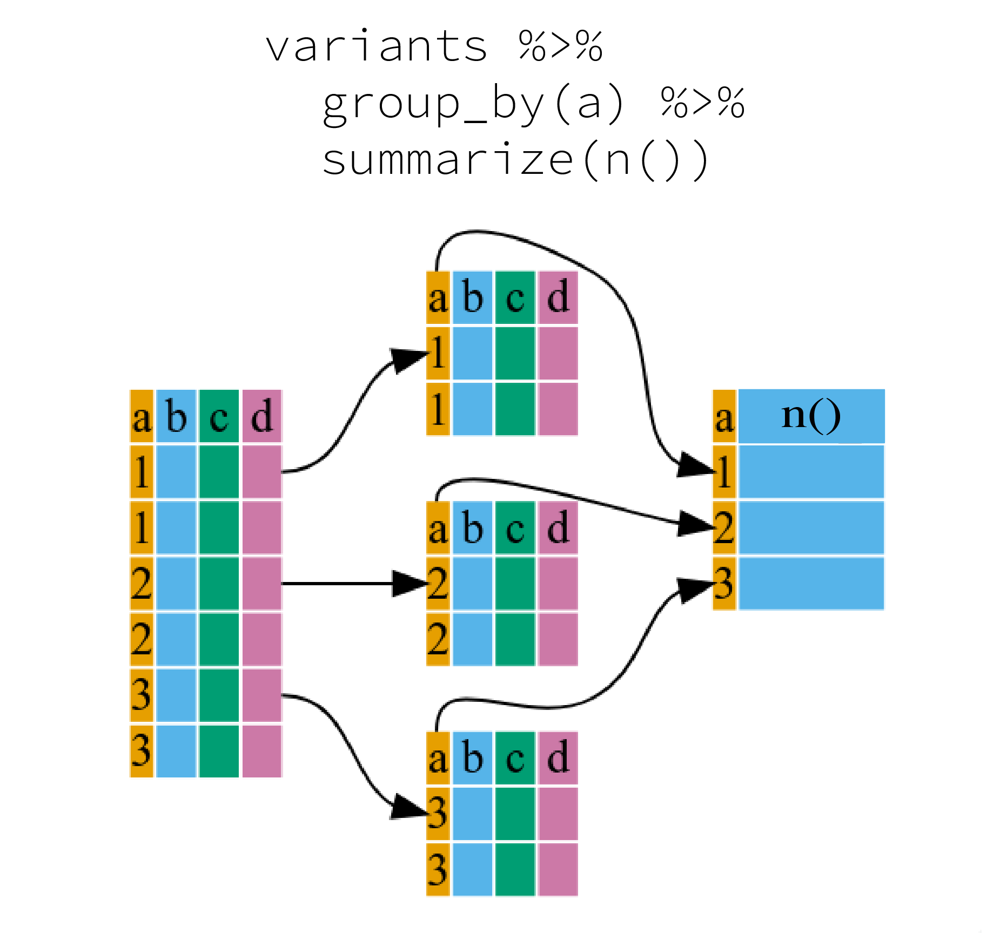

[Aggregating and Analyzing Data with
dplyr](https://datacarpentry.org/genomics-r-intro/04-dplyr/index.html)

## Questions

-   How can I manipulate data frames without repeating myself?

## Objectives

-   Select certain columns in a data frame with the **`dplyr`** function
    `select`.

-   Extract certain rows in a data frame according to logical (boolean)
    conditions with the **`dplyr`** function `filter`.

-   Link the output of one **`dplyr`** function to the input of another
    function with the 'pipe' operator `%>%`.

-   Add new columns to a data frame that are functions of existing
    columns with `mutate`.

-   Use the split-apply-combine concept for data analysis.

-   Use `summarize`, `group_by`, and `count` to split a data frame into
    groups of observations, apply summary statistics for each group, and
    then combine the results.

-   Employ the 'split-apply-combine' concept to split the data into
    groups, apply analysis to each group, and combine the results.

-   Export a data frame to a .csv file.

# **Data manipulation using `dplyr`** and **`tidyr`** from **`tidyverse`** package

Bracket subsetting is handy, but it can be cumbersome and difficult to
read, especially for complicated operations.

Luckily, the [`dplyr`](https://cran.r-project.org/package=dplyr) package
provides a number of very useful functions for manipulating data frames
in a way that will reduce repetition, reduce the probability of making
errors, and probably even save you some typing.

As an added bonus, you might even find the `dplyr` grammar easier to
read.

Here we're going to cover some of the most commonly used functions as
well as using pipes (`|>`) to combine them:

1.  `select()`

2.  `filter()`

3.  `group_by()`

4.  `summarize()`

5.  `mutate()`

Packages in R are sets of additional functions that let you do more
stuff in R.

The functions we've been using, like `str()`, come built into R;
packages give you access to more functions.

You need to install a package and then load it to be able to use it

```{r}
## installs dplyr package
## install tidyr
## install readr package
## load packages using library()
```

## **What is dplyr?**

The package `dplyr` is a fairly new (2014) package that tries to provide
easy tools for the most common data manipulation tasks.

This package is also included in the [`tidyverse`
package](https://www.tidyverse.org/), which is a collection of eight
different packages

(`dplyr`, `ggplot2`, `tibble`, `tidyr`, `readr`, `purrr`, `stringr`, and
`forcats`).

It is built to work directly with data frames.

### **Loading .csv files in tidy style**

The Tidyverse's `readr` package provides its own unique way of loading
.csv files in to R using `read_csv()`, which is similar to `read.csv()`.

`read_csv()` allows users to load in their data

1.  faster,

2.  doesn't create row names, and

3.  allows you to access non-standard variable names (ie. variables that
    start with numbers of contain spaces),

4.  and outputs your data on the R console in a tidier way.

    In short, it's a much friendlier way of loading in potentially messy
    data.

```{r}
# Read in rawdata/combined_tidy_vcf.csv using the readr package's read_csv function


```

### Taking a quick look at data frames

Similar to `str()`, which comes built into R, `glimpse()` is a `dplyr`
function that (as the name suggests) gives a glimpse of the data frame.

```{r}
#use glimpse on variants
```

In the above output, we can already gather some information about
`variants`, such as the number of rows and columns,

column names,

type of vector in the columns, and the first few entries of each column.

Although what we see is similar to outputs of `str()`, this method gives
a cleaner visual output.

# Selecting columns and filtering rows

Using bracket notation, in order to pull out certain columns, we would
have to know which index referred to that column,

which took an extra step,

and if we had re-ordered our columns or added one in the middle, the
indexes in our script would suddenly refer to the 'wrong' column, which
might cause confusion!

As a refresher, here's how we pulled out columns using the bracket
notation:

```{r}
# get columns: sample_id, REF, ALT, DP
variants_tbl[, c(1, 5, 6, 12)]
```

But our code isn't very easy to understand and we'd need to see the
output to make sure we had the correct columns.

Enter `dplyr`!

#### **How to `select()`** columns

To select columns of a data frame, use dplyr's `select()` function.

The first argument to this function is the data frame (`variants`), and
the subsequent arguments are the columns to keep.

**Note, In tidyverse, e.g. dplyr we do not quote "" column names**

```{r dplyr_select}
#select sample_id, REF, ALT, DP from variants df using select (note don't use pipe)

```

This code is much easier to understand!

To select all columns except certain ones, put a "`-`" in front of the
variable to exclude it.

select all but CHROM column

```{r dplyr_select_negate}
#select all columns in variants but CHROM column (note don't use pipe)

```

## [selection helpers](https://noteable.edina.ac.uk/user/jggyj4w4chknqatfm2ddvp/rstudio/help/library/tidyselect/help/language)

`dplyr` also provides useful functions to select columns based on their
names.

-   [`starts_with()`](https://noteable.edina.ac.uk/user/jggyj4w4chknqatfm2ddvp/rstudio/help/library/tidyselect/help/starts_with):
    Starts with a prefix.

-   [`ends_with()`](https://noteable.edina.ac.uk/user/jggyj4w4chknqatfm2ddvp/rstudio/help/library/tidyselect/help/ends_with):
    Ends with a suffix.

-   [`contains()`](https://noteable.edina.ac.uk/user/jggyj4w4chknqatfm2ddvp/rstudio/help/library/tidyselect/help/contains):
    Contains a literal string.

-   [`matches()`](https://noteable.edina.ac.uk/user/jggyj4w4chknqatfm2ddvp/rstudio/help/library/tidyselect/help/matches):
    Matches a regular expression.

-   [`num_range()`](https://noteable.edina.ac.uk/user/jggyj4w4chknqatfm2ddvp/rstudio/help/library/tidyselect/help/num_range):
    Matches a numerical range like x01, x02, x03.

For instance, `ends_with()`

```{r dplyr_ends_with}
# select columns that end with B

```

------------------------------------------------------------------------

## **Exercise**

From the `variants_tbl`

1.  Create a table that `contains` all the columns with the letter "`i`"
    and column "`POS`"

Hint: look at the help function `contains()`

```{r}

```

------------------------------------------------------------------------

## dplyr filtering

To choose rows, we can use dplyr's `filter()` function.

For instance, to keep the rows for the `sample_id` `SRR2584863`:

```{r dplyr_filter}
# use dplyr's filter function to keep the rows for the sample_id SRR2584863 in variants:


```

Note that this is equivalent to the base R code below, but is easier to
read!

```{r r_base_filter}
# base R code
variants_tbl[variants_tbl$sample_id == "SRR2584863",]
```

`filter()`will keep all the rows that match the conditions that are
provided.

Here are a few examples:

```{r dplyr_filter_examples}

## rows for which the reference genome has T or G

# rows that don't have missing data in the IDV column

# rows with QUAL values greater than or equal to 100

# rows that have TRUE in the column INDEL (not this is boolean column)

```

`filter()` allows you to combine multiple conditions.

You can separate them using a comma `,` as arguments to the function,

they will be combined using the `&` (AND) logical operator.

If you need to use the `|` (OR) logical operator, you can specify it
explicitly:

```{r}

# filter variants using for sample_id SRR2584863 and QUAL score >= 100


```

```{r}
# using `|` logical operator
# filter variants_tbl for sample_id SRR2584863 and (variants is INDEL or QUAL score >= 100)

```

------------------------------------------------------------------------

## **Exercise: dplyr filter**

Select all the mutations that occurred between the positions 1e6 (one
million) and 2e6 (inclusive) that have a `QUAL` greater than 200, and
exclude `INDEL` mutations.

**Hint**: to flip logical values such as TRUE to a FALSE,

we can use to negation symbol `!`. (eg. !TRUE == FALSE).

```{r}

```

------------------------------------------------------------------------

## Pipes

But what if you wanted to `select` and `filter`?

We can do this with pipes.

Pipes let you take the output of one function and send it directly to
the next

Pipes in R look like `|>` ; Previous only available via the `magrittr`
package, which is installed as part of dplyr using `%>%`.

type the pipe with `Ctrl + Shift + M`if you're using a PC,
o`r Cmd + Shift + M` if you're using a Mac.

Use pipes together with select and filter to get `REF`, `ALT`, `DP`
columns for `sample_id` `SRR2584863`

```{r pipe_example}
# Use pipes together with select and filter to get REF, ALT, DP columns 
# for sample_id SRR2584863

```

In the above code, we use the pipe to send the `variants` data set first
through

`filter()`, to keep rows where `sample_id` matches a particular sample,

and then through `select()` to keep only the `REF`, `ALT`, and `DP`
columns.

Since `%>%` takes the object on its left and passes it as the first
argument to the function on its right, we don't need to explicitly
include the data frame as an argument to the `filter()` and `select()`
functions any more.

Some may find it helpful to read the pipe like the word "then".

For instance, in the above example, we took the data frame `variants`,

*then* we `filter`ed for rows where `sample_id` was SRR2584863,

*then* we `select`ed the `REF`, `ALT`, and `DP` columns, *then* we
showed only the first six rows.

The **`dplyr`** functions by themselves are somewhat simple, but by
combining them into linear workflows with the pipe, we can accomplish
more complex manipulations of data frames.

### Create new object

We want to create a new object with this smaller version of the data we
can do so by assigning it a new name:

```{r pipe_example_new_variable}
# Use pipes together with select and filter to get REF, ALT, DP columns for sample_id SRR2584863 and save to new dataframe SRR2584863_variants


# print SRR2584863_variants

```

Similar to `head()` and `tail()` functions, we can also look at the
first or last six rows using tidyverse function `slice()`.

Slice is a more versatile function that allows users to specify a range
to view:

```{r}
# view first six rows
SRR2584863_variants %>% slice(1:6)

# rows 10:25
```

------------------------------------------------------------------------

## **Exercise: Pipe and filter**

Starting with the `variants` dataframe, use pipes `|>` to subset the
data to

1.  include only observations from `SRR2584863` sample,

2.  Where the filtered depth (`DP`) is at least 10.

3.  Retain only the columns `sample_id`, `REF`, `ALT`, and `POS`.

```{r exercise answer}

```

------------------------------------------------------------------------

## Adding a column, Mutate

Frequently you'll want to create new columns based on the values in
existing columns,

For this we'll use the `dplyr` function `mutate()`.

We have a column titled "`QUAL`".

This is a Phred-scaled confidence score that a polymorphism exists at
this position given the sequencing data.

Lower QUAL scores indicate low probability of a polymorphism existing at
that site.

We can convert the confidence value QUAL to a probability value
according to the formula:

`Probability = 1- 10 ^ -(QUAL/10)`

Let's add a column (`POLPROB`) to our `variants` dataframe that shows
the probability of a polymorphism at that site given the data.

```{r adding_a_column_using_dplyr}
# add a column using mutate (POLPROB) to our variants dataframe using following formula: 
# 1 - (10 ^ -(QUAL/10)

```

------------------------------------------------------------------------

## **Exercise**

There are a lot of columns in our dataset, so let's just look at the

`sample_id`, `POS`, `QUAL`, and `POLPROB` columns for now.

Add a line to the below code to only show those columns.

```{r exercise_answer}
variants %>%
  mutate(POLPROB = 1 - (10 ^ -(QUAL/10)))

```

------------------------------------------------------------------------

### Extra (can skip)

Let's create a new column, called "`indel_size`" that contains the size
difference between the our sequences and the reference genome.

The function, `nchar()` returns the number of letters in a string.

```{r}
variants %>%
  mutate(indel_size = nchar(ALT) - nchar(REF)) %>% 
  select(ALT,REF,indel_size)
```

```{r variants_indel}
variants_indel <- variants %>%
  mutate(
    indel_size = nchar(ALT) - nchar(REF),
    mutation_type = case_when(
      indel_size > 0 ~ "insertion",
      indel_size < 0 ~ "deletion",
      indel_size == 0 ~ "point"
    ))
```

## Split-apply-combine data analysis and the summarize() function

Many data analysis tasks can be approached using the
"`split-apply-combine`" paradigm:

1.  `split` the data into groups,
2.  `apply` some analysis to each group,
3.  and then `combine` the results. dplyr makes

This very easy through the use of the

`group_by()`function, which splits the data into groups.

We can use `group_by()` to tally the number of mutations detected in
each sample using the function `tally()`:

```{r}
# group by sample_id and use tally function
variants %>%
  group_by(sample_id) %>%
  tally()
```

Since counting or tallying values is a common use case for `group_by()`,
an alternative function was created to bypasses `group_by()` using the
function `count()`:

```{r}
# using count() function to combibe grouyp_by and tally in one
```

------------------------------------------------------------------------

**Exercise**

-   How many mutations are INDELs?

```{r exercise answer}

```

------------------------------------------------------------------------

When the data is grouped in this way the `summarize()` function can be
used to collapse each group into a single-row summary.

`summarize()`does this by applying an aggregating or summary function to
each group.

It can be a bit tricky at first, but we can imagine physically splitting
the data frame by groups and applying a certain function to summarize
the data.

{width="558"}

```{r}
# For example, if we wanted to group by sample_id and 
# find the number of rows ,n() , of data for each sample, we would do:

```

We can also apply many other functions to individual columns to get
other summary statistics.

For example, we can use built-in functions like

`mean()`,

`median()`,

`min()`, and

`max()`.

These are called "built-in functions" because they come with R and don't
require that you install any additional packages.

```{r group_by}
# summarise by sample_id 
# mean DP
# median DP
# min DP
# max DP


```

### Reshaping data frames

It can sometimes be useful to transform the "long" tidy format, into the
wide format.

This transformation can be done with the `pivot_wider()` function
provided by the `tidyr` package (also part of the `tidyverse`).

`pivot_wider()` takes a data frame as the first argument, and two
arguments:

1.  the column name that will become the columns and

2.  the column name that will become the cells in the wide data.

```{r}
variants_wide <- variants %>%
  group_by(sample_id, CHROM) %>%
  summarize(mean_DP = mean(DP))

# create a wide table variants_wide by using pivot_wider function that uses sample_id as columns and mean_DP as values

```

The opposite operation of `pivot_wider()` is taken care by
`pivot_longer()`.

We specify the names of the new columns,

and here add `-CHROM` as this column shouldn't be affected by the
reshaping:

```{r}

```

\

## Key Points

-   Use the `dplyr` package to manipulate dataframes.

-   Use `select()`to choose variables from a dataframe.

-   Use `filter()` to choose data based on values.

-   Use the pipe operator `|>` to join functions

-   Use `group_by()` and`summarize()` to work with subsets of data.

-   Use `mutate()` to create new variables.
