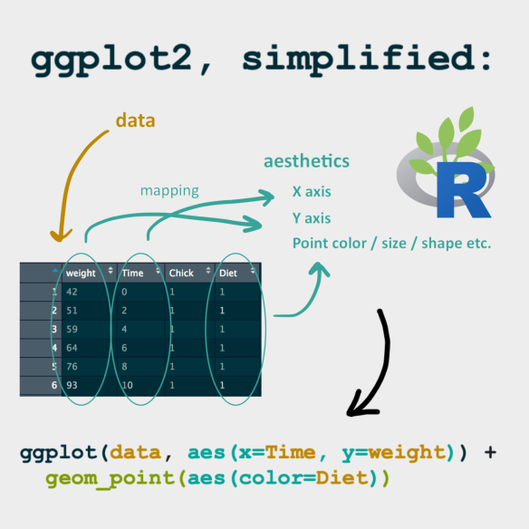

# **Data Visualization with ggplot2**

<https://datacarpentry.org/genomics-r-intro/06-data-visualization.html>

In this final lesson you will use the R package ggplot2 to visualize
your data.

We start by loading the package ggplot2. either on it's own or via
[tidyverse](https://www.tidyverse.org/packages/)

```{r load_ggplot2}
# install ggplot2
# load library ggplot2

```

## **Loading the dataset**

We will read in variants dataset using `read_csv()` function

```{r}
# load variants dataset using read_csv from readr package
variants = read_csv("https://raw.githubusercontent.com/naupaka/vcfr-for-data-carpentry-draft/main/output/combined_tidy_vcf.csv")

glimpse(variants) 
# Show a snapshot of the rows and columns
```

## Plotting with ggplot2

`ggplot2` is a plotting package that makes it simple to create complex
plots from data in a data frame.

It provides a more programmatic interface for specifying what variables
to plot, how they are displayed, and general visual properties.

Therefore, we only need minimal changes if the underlying data change or
if we decide to change from a bar plot to a scatter plot.

This helps in creating publication quality plots with minimal amounts of
adjustments and tweaking.

ggplot2 functions like data in the '`long`' format,

-   A column for every dimension,

-   A row for every observation.

    {width="524"}

Well-structured data will save you lots of time when making figures with
ggplot2

## Constructing ggplots

ggplot graphics are built step by step by adding new elements.

Adding layers in this fashion allows for extensive flexibility and
customization of plots.

To build a ggplot, we will use the following basic template that can be
used for different types of plots:

    ggplot(data = <DATA>, mapping = aes(<MAPPINGS>)) +  <GEOM_FUNCTION>()

{width="385"}

To build a ggplot, we will use the following basic template that can be
used for different types of plots:

```{r}
# initizalie ggplot with variants dataframe
# use the ggplot() function and bind the plot to a specific data frame using the data argument
```

-   define a mapping (using the aesthetic (`aes`) function), by
    selecting the variables to be plotted and specifying how to present
    them in the graph, e.g. as x and y positions or characteristics such
    as size, shape, color, etc.

```{r ggplot_01}
#use the ggplot() function and bind the variants data's POS to x axis and DP to y axis 

```

This produces an empty plot with just the axes

## geoms

ggplot2 uses `geoms` as graphical representations of the data in the
plot (points, lines, bars).

Some `geoms` below

{width="602"}

As seen above ggplot2 offers many different `geoms`; we will use some
common ones today, including:

-   `geom_point()` for scatter plots, dot plots, etc.
-   `geom_bar()` for barplots
-   `geom_density()` for density plots

### Adding geoms

To add a `geom` to the plot use the `+` operator.

Because we have two continuous variables `POS` and `DP`, we will use
[`geom_point()`](https://ggplot2.tidyverse.org/reference/geom_point.html)first
to create a scatterplot:

```{r ggplot_add_geom}
# add geom _point() to previous code
ggplot(data = variants, aes(x = POS, y = DP)) 
```

The `+` in the ggplot2 package is particularly useful because it allows
you to modify existing ggplot objects.

This means you can easily set up plot templates and conveniently explore
different types of plots,

so the above plot can also be generated with code like this:

```{r}
# Assign plot to a object coverage_plot
# ggplot(data = variants, aes(x = POS, y = DP))


# Draw the plot coverage_plot using geom_point()

```

**Notes**

-   Anything you put in the
    [`ggplot()`](https://ggplot2.tidyverse.org/reference/ggplot.html)
    function can be seen by any geom layers that you add (i.e., these
    are universal plot settings). This includes the x- and y-axis
    mapping you set up in
    [`aes()`](https://ggplot2.tidyverse.org/reference/aes.html).

-   You can also specify mappings for a given geom independently of the
    mappings defined globally in the
    [`ggplot()`](https://ggplot2.tidyverse.org/reference/ggplot.html)
    function.

-   The `+` sign used to add new layers must be placed at the end of the
    line containing the *previous* layer.

    -   If, instead, the `+` sign is added at the beginning of the line
        containing the new layer, **`ggplot2`** will not add the new
        layer and will return an error message.

```{r}
# This is the correct syntax for adding layers
coverage_plot +
  geom_point()

# This will not add the new layer and will return an error message
coverage_plot
  + geom_point()
```

\

## Building your plots iteratively

Building plots with ggplot2 is typically an iterative process.

We start by defining the dataset we'll use, lay out the axes, and choose
a geom

```{r ggplot_build_it}
  ggplot(data = variants, aes(x = POS, y = DP))+
    geom_point()
```

Then, we start modifying this plot to extract more information from it.

To see what we can can change we can look at the geom_points webpage
[here](https://ggplot2.tidyverse.org/reference/geom_point.html)

So we can use geom_point **Aesthetics**

-   **`x`**

-   **`y`**

-   `alpha`

-   `colour`

-   `fill`

-   `group`

-   `shape`

-   `size`

-   `stroke`

The aesthetics `x` and `y` have already been mapped to `POS` and `DP` in
our ggplot2 object.

We can either map some variables to one of the remaining **Aesthetics**
or provide a single value.

For instance, we can add transparency (`alpha`) values from 0-1 to avoid
over plotting:

```{r ggplot_int_02}
# can add transparency (alpha) to avoid over plotting:
ggplot(data = variants, aes(x = POS, y = DP)) 
    geom_point()
```

We can also add colors for all the points:

```{r ggplot_it_03}
# add color blue to geom_point
  ggplot(data = variants, aes(x = POS, y = DP)) +
    geom_point(alpha = 0.5)
```

We could also map the variable `sample_id` to the aes to assign the
color to a species.

ggplot2 will provide a different color corresponding to different
values.

Here is an example where we map the aes `color` with `sample_id`:

```{r ggplot_it_04}
# use sample_id to assign color in the mapping aes

ggplot(data = variants, aes(x = POS, y = DP)) + 
geom_point(alpha = 0.5)
```

## Labelling plots

To make our plot more readable, we can add axis labels using the ggplot
helper function
[`labs`](https://ggplot2.tidyverse.org/reference/labs.html)`()`:

x = "Base Pair Position"

y = "Read Depth (DP)"

```{r ggplot_it_labels}
#  add label using labs()
# x = "Base Pair Position" 
# y = "Read Depth (DP)"
  ggplot(data = variants, aes(x = POS, y = DP, color = sample_id)) + 
  geom_point(alpha = 0.5) 
```

To add a main title "Read Depth vs. Position" to the plot, we use
`ggtitle()`

```{r}
# add main title using ggtitle "Read Depth vs. Position
ggplot(data = variants, aes(x = POS, y = DP, color = sample_id)) +
  geom_point(alpha = 0.5) +
  labs(x = "Base Pair Position",
       y = "Read Depth (DP))
```

## Saving ggplots

Now the figure is complete and ready to be exported and saved to a file.

This can be achieved easily using the function
[`ggsave()`](https://ggplot2.tidyverse.org/reference/ggsave.html),

`ggsave` can write, by default, the most recent generated figure into
different formats (e.g., `jpeg`, `png`, `pdf`) according to the file
extension you give.

So, for example, to create a pdf version of the above figure with a
dimension of 6 by 4 inches:

```{r}
# create a folder results using dir.create
dir.create("results")
# use ggsave width=6 and height =4 as pdf to results/depth.pdf
# now as a jpeg

```

------------------------------------------------------------------------

## **Exercise: scatterplots**

Use what you just learned to create a scatter plot of mapping quality
(`MQ`) over position (`POS`) with the samples showing in different
colors.

Make sure to give your plot relevant axis labels.

```{r exercise_answer}

```

------------------------------------------------------------------------

## Faceting

`ggplot2` has a special technique called faceting that allows the user
to split one plot into multiple plots based on a variable included in
the dataset.

Sometime this is referred to as [small
multiples](https://en.wikipedia.org/wiki/Small_multiple)

We will use it to split our mapping quality plot into three panels, one
for each sample.

`facet_grid()`

```{r ggplot_it_facet}
# facet by sample_id using facet_grid
ggplot(data = variants, aes(x = POS, y = MQ, color = sample_id)) + 
 geom_point() + 
 labs(x = "Base Pair Position", 
      y = "Mapping Quality (MQ)") 
```

This looks ok, but it would be easier to read if the plot facets were
stacked vertically rather than horizontally.

The facet_grid geometry allows you to explicitly specify how you want
your plots to be arranged via formula notation`(rows ~ columns)` .

A period `.` can be used as a placeholder that indicates only one `row`
or `column`).

```{r ggplot_it_facet_02}
# change to facet by row
ggplot(data = variants, aes(x = POS, y = MQ, color = sample_id)) + 
 geom_point() + 
 labs(x = "Base Pair Position", 
      y = "Mapping Quality (MQ)") + 
 facet_grid(.~sample_id)
```

### Themes

Usually plots with white background look more readable when printed.

We can set the background to white using the function
[`theme_bw()`](https://ggplot2.tidyverse.org/reference/ggtheme.html).

Additionally, you can remove the grid:

```{r}
# add theme_bw()
#  theme(panel.grid = element_blank()) 

ggplot(data = variants, aes(x = POS, y = MQ, color = sample_id)) +
  geom_point() +
  labs(x = "Base Pair Position",
       y = "Mapping Quality (MQ)") +
  facet_grid(sample_id ~ .) +

```

------------------------------------------------------------------------

## **Exercise**

Use what you just learned to create a scatter plot of PHRED scaled
quality (`QUAL`) over position (`POS`) with the samples showing in
different colors.

Make sure to give your plot relevant axis labels.

Alter the plot from the previous exercise by faceting by rows.

Make sure to give your plot relevant axis labels.

```{r}

```

------------------------------------------------------------------------

# Barplots

Another commonly used plot is the barplot to display the count of a
discrete variable

We can create barplots in ggplot2 using the
[`geom_bar()`](https://ggplot2.tidyverse.org/reference/geom_bar.html)
geom.

`geom_bar` is designed to make it easy to create bar charts that show
counts.

In geom_bar the aes mapped to `x` is the variable for the count.

If you wish to flip the orientation use `y`

Let's make a `barplot` showing the number of INDELs (`INDEL`) .

```{r ggplot_geom_bar}
# make a bar plot using geom_bar wiht counts of INDEL using x 


```

We can map another variable to the data using the aes `fill` ,

Notes `fill` and `color` are different aes

for example to create a stacked bar chart using sample_id

```{r}
# make a bar chart using geom_bar
 ggplot(variants,aes(x=INDEL))+
  geom_bar()
```

Note is you want to make a barchart based on a single value using geom
`geom_col`

```{r}
# create bar chart for a value mean_DP using geom_col
variants|>
  group_by(sample_id) |>
  summarise(mean_DP=mean(DP)) 
```

## **Density**

We can create density plots using the
[`geom_density`](https://ggplot2.tidyverse.org/reference/geom_density.html)
geom that shows the distribution of of a single continous variable in
the dataset.

Let's plot the distribution of variant depth `DP`

```{r}
# Using the geom_density geom that shows the distribution of of a depth DP as x in variants data frame.


# add color equal to sample_id
```

# Themes

We can change the look of the ggplots using`themes()`

This gives use greater control, however it is quite involved.

{width="702"}

Therefore, ggplot has a number of built in themes.

<https://ggplot2.tidyverse.org/reference/ggtheme.html>


E.g. Usually plots with white background look more readable when
printed.

We can set the background to white using the function `theme_bw()`.

```{r ggplot_it_themes}
ggplot(data = variants, aes(x = POS, y = MQ, color = sample_id)) + 
  geom_point() + 
  labs(x = "Base Pair Position", 
       y = "Mapping Quality (MQ)") + 
  facet_grid(sample_id ~ .) 
```

Here is a link to elements you can change
<https://isabella-b.com/blog/ggplot2-theme-elements-reference/>

------------------------------------------------------------------------

### EXERCISE

With all of this information in hand, please take another five minutes
to either improve one of the plots generated in this exercise or create
a beautiful graph of your own. Use the RStudio [**`ggplot2`** cheat
sheet](https://raw.githubusercontent.com/rstudio/cheatsheets/main/data-visualization.pdf)
for inspiration. Here are some ideas:

-   See if you can change the size or shape of the plotting symbol.

-   Can you find a way to change the name of the legend? What about its
    labels?

-   Try using a different color palette (see the [Cookbook for
    R](https://www.cookbook-r.com/Graphs/Colors_(ggplot2)/).

------------------------------------------------------------------------

## **More `ggplot2`** Plots

**`ggplot2`** offers many more informative and beautiful plots (`geoms`)
of interest for biologists (although not covered in this lesson) that
are worth exploring, such as

-   [`geom_tile()`](https://ggplot2.tidyverse.org/reference/geom_tile.html),
    for heatmaps,

-   [`geom_jitter()`](https://ggplot2.tidyverse.org/reference/geom_jitter.html),
    for strip charts, and

-   [`geom_violin()`](https://ggplot2.tidyverse.org/reference/geom_violin.html),
    for violin plots

## **Resources**

-   [ggplot2: Elegant Graphics for Data
    Analysis](https://www.amazon.com/gp/product/331924275X/) ([online
    version](https://ggplot2-book.org/))

-   [The Grammar of Graphics (Statistics and
    Computing)](https://www.amazon.com/Grammar-Graphics-Statistics-Computing/dp/0387245448/)

-   [Data Visualization: A Practical
    Introduction](https://www.amazon.com/gp/product/0691181624/)
    ([online version](https://socviz.co/))

-   [The R Graph Gallery](https://r-graph-gallery.com/) ([the
    book](https://bookdown.org/content/b298e479-b1ab-49fa-b83d-a57c2b034d49/))

-   <https://www.cedricscherer.com/top/dataviz/>

## **Key Points**

-   ggplot2 is a powerful tool for high-quality plots

-   ggplot2 provides a flexiable and readable grammar to build plots
